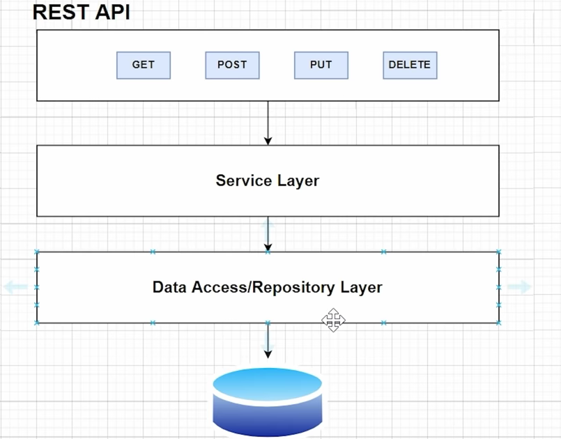
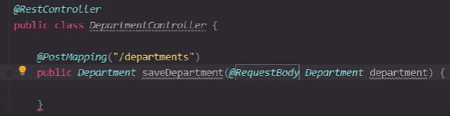
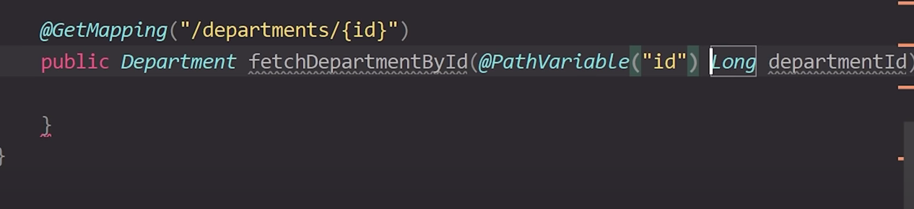
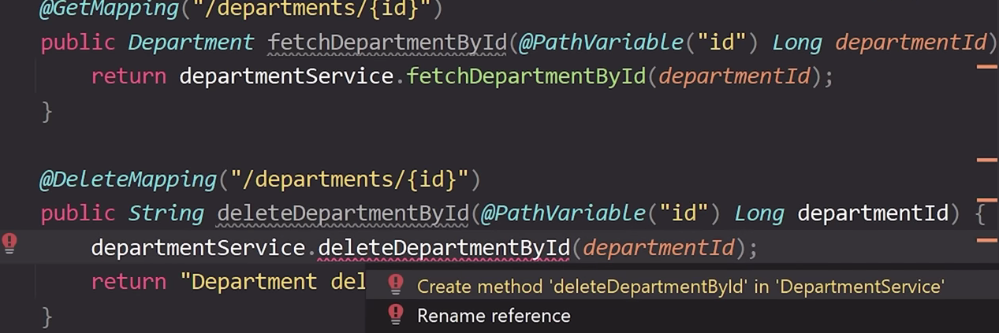

# Springboot Master Class

> 地址：https://www.youtube.com/watch?v=zvR-Oif_nxg&list=PLeO9-DFwl7mXA-H9W0ef5THaQ6WCjxBjT&index=9&t=15321s

开头讲解了AOP，引入了横向编程的思想，简单讲解了控制反转，搭建了一个基于H2 database的web空项目，正片从 `01:42:00`开始。


main annotation -> SpringBootApplication

- springbootConfiguration (main configuration -> )
- EnableAutofiguration


### Running springboot application

-> `01:53:28`


> tip: main-application-app>  mvn spring-boot:run comand can run project

> tip: property [spring-boot-devtools](https://segmentfault.com/a/1190000020594808) used to auto-restart-project





annotation @RequestBody : 

​	whatever json you are getting, get that particular josn and convert that particular json to my entity


#### pass a parameter




>tip: addresses can be reused using get and delete annotations




### update

##### controller

```java
@PutMapping("/department/{id}")
public Department updateDepartment(@pathVariable("id") Long depatmentId,
                                  @RequestBody Department department) {
    return departmentService.updateDepartment(departmentId, department);
}
```


##### service

```java
@Override
public Department updateDepartment(Long department, Department department) {
    Department depDB = departmntRepository.findById(departmentId).get();
    
    if (Object.nonNull(department.getDepartmentName()) &&
       !"".equalsIgnoreCase(department.getDepartmentName())) {
        depDB.setDepartmentName(deparment.getDepartmentName());
    }
    ...
    
    return departmentRepository.save(depDB)
}
```


### property:  Hibernate Validation

use

1. add the annotation over the attribute in entity, like...

   - @NotBlank(message = "Please Add Department Name")
   - @Length(max = 5, min = 2)
   - @Size(max = 10, min = 0)
   - @Email
   - Positive
   - Negative
   - PositiveOrZero
   - NegativeOrZero
   - Future
   - FutureOrPresent
   - Past
   - PastOrPresent

2. add annotation `@Valid` over here in controller
   ```java
   @postMapping("/departments")
   public Department saveDepartment (@Valid @RequestBody Department department) {
       return departmentService.saveDepartment(department);
   }
   ```

### 

### Adding Loggers

1. adding loggers' constant in class(DepartmentController.class)
   ```java
   final Logger LOGGER = LoggerFactory.getLogger(name: DepartmentController.class);
   ```

2. add loggers...
   ```java
   @PostMapping("/depatments")
   public Department saveDepartment (@Valid @RequestBody Department department) {
       LOGGER.info("Inside saveDepartment of DepartmentController");
       return departmentService.saveDepartment(department);
   }
   ```

   

### Exception

create a Exception class `DepartmentNotFoundException.class`

```java
public class DepartmentNotFoundException extends Exception {
    public DepartmentNotFoundException() {
        super();
    }

    public DepartmentNotFoundException(String message) {
        super(message);
    }

    public DepartmentNotFoundException(String message, Throwable cause) {
        super(message, cause);
    }

    public DepartmentNotFoundException(Throwable cause) {
        super(cause);
    }

    protected DepartmentNotFoundException(String message, Throwable cause, boolean enableSuppression, boolean writableStackTrace) {
        super(message, cause, enableSuppression, writableStackTrace);
    }
}
```

thorw exception

```java
@Override
public Department fetchDepartmentById(Long departmentId) throws DepartmentNotFoundException {
    Optional<Department> department =
        departmentRepository.findById(departmentId);
    if (department.isEmpty()) {
        throw new DepartmentNotFoundException("Department Not Available");
    }

    return department.get();
}
```

### Exception Handler

> return exception's  response

- create an errorMessage eneity
  ```java
  @Data
  @NoArgsConstructor
  @AllArgsConstructor
  public class ErrorMessage {
      private HttpStatus status;
      private String message;
  }
  ```

- create RestResponseEntityExceptionHandler.class
  ```java
  @ControllerAdvice
  @ResponseStatus
  public class RestResponseEntityExceptionHandler extends ResponseEntityExceptionHandler {
      @ExceptionHandler(DepartmentNotFoundException.class)
      public ErrorMessage departmentNotFountException(DepartmentNotFoundException exception, WebRequest request) {
          ErrorMessage message = new ErrorMessage(HttpStatus.NOT_FOUND,
                  exception.getMessage());
  
          return ResponseEntity.status(HttpStatus.NOT_FOUND)
                  .body(message);
      }
  }
  ```

  


